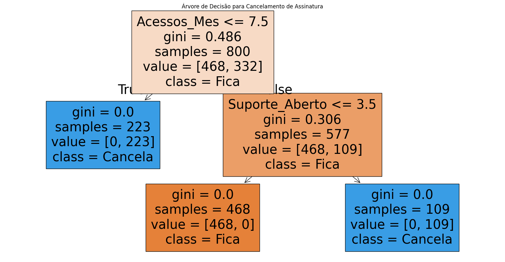

# 📉 Previsão de Churn - Plataforma de Streaming

Este projeto utiliza **Machine Learning** para identificar utilizadores com risco de cancelar a subscrição.

## 🚀 Como funciona
O modelo analisa o comportamento do utilizador (acessos, suporte aberto, mensalidade) e prevê se ele irá abandonar a plataforma.

## 📊 Insights Principais
- **Engajamento:** Utilizadores com menos de 8 acessos mensais são críticos.
- **Suporte:** Mais de 3 tickets de suporte indicam insatisfação iminente.

## 🛠️ Tecnologias
- Python (Pandas, Seaborn, Scikit-Learn)
- Modelo: Árvore de Decisão

## 📈 Resultados
 O modelo atingiu **98% de acurácia** nos dados de teste.
